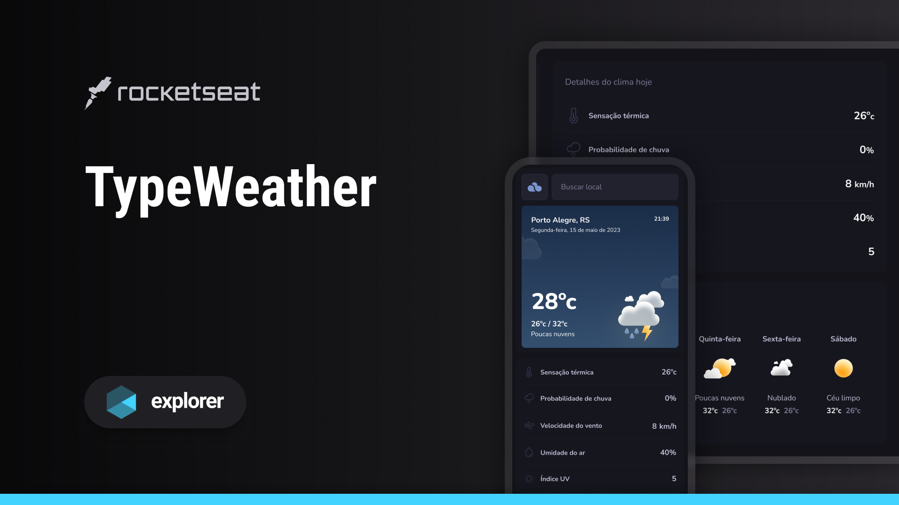

<h1 align="center"> TypeWeather </h1>

O Programa TypeWeather é o meu projeto mais recente,uma aplicação de previsão do tempo Web.  

  <a href="#-tecnologias">Tecnologias</a>&nbsp;&nbsp;&nbsp;|&nbsp;&nbsp;&nbsp;
  <a href="#-projeto">Projeto</a>&nbsp;&nbsp;&nbsp;|&nbsp;&nbsp;&nbsp;
  <a href="#-layout">Layout</a>&nbsp;&nbsp;&nbsp;|&nbsp;&nbsp;&nbsp;
  <a href="#memo-licença">Licença</a>

  

 

  

## 🚀 Tecnologias

Esse projeto foi desenvolvido com as seguintes tecnologias:

- HTML e CSS
- JavaScript
- Git e Github
- Figma

---

## 💻 Projeto

O TypeWeather é uma aplicação web para consultar dados meteorológicos e previsão do tempo.

--- 

## 🔖 Layout :dart: :computer:

Você pode visualizar o layout do projeto através [DESSE LINK](https://www.figma.com/community/file/1270841135856047223). É necessário ter conta no [Figma](https://figma.com) para acessá-lo.

## :memo: Licença

Esse projeto está sob a licença MIT.

---

Feito com ♥ by Kelvy Tagliacolli :computer:
